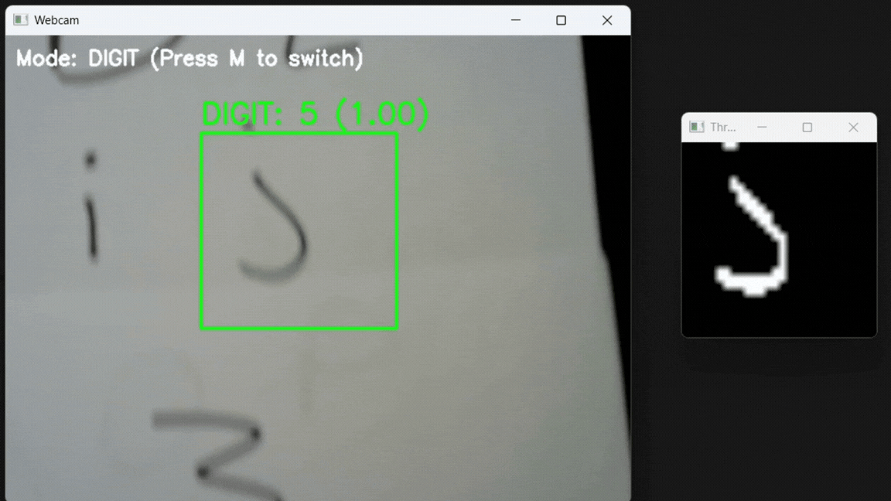

# Live Number and Character Recognition

Real-time digit and character recognition using CNN models with webcam input.

## Overview

This project uses Convolutional Neural Networks (CNNs) to recognize handwritten digits (0-9) and characters (A-Z, a-z) in real-time through a webcam feed. The system includes two trained models:
- **Digits model** (`model.h5`): Recognizes numbers 0-9
- **Characters + Digits model** (`model_char_num.h5`): Recognizes both letters and numbers using EMNIST dataset

## Features

- Real-time webcam recognition with live preview
- Switchable modes between digit-only and character+digit recognition
- Preprocessing pipeline for improved accuracy (resizing, blur, sharpening, thresholding)
- Visual feedback with confidence scores
- ROI (Region of Interest) selection for focused recognition

## Live Demos

| Demo 1 | Demo 2 |
| --- | --- |
|  |  |

## Model Insights

- **CharCNN confusion matrix:** 
- **CNN activations before hidden layer:** 
- **CNN activations after hidden layer:** 

## Setup

1. Install dependencies:
```bash
pip install -r requirements.txt
```

2. Run the webcam recognition:
```bash
python simple_webcam_recognition.py
```

## Usage

- **Q**: Quit the application
- **M**: Switch between digit mode and character mode
- Draw digits or characters in the ROI box (green rectangle)
- Recognition results display with confidence scores

## Training

The Jupyter notebooks (`CNN.ipynb`, `Char CNN.ipynb`, `GPU CHAR CNN.ipynb`) contain the training code for the models using the EMNIST dataset.

## Requirements

- Python 3.x
- OpenCV
- TensorFlow/Keras
- NumPy
- Matplotlib

