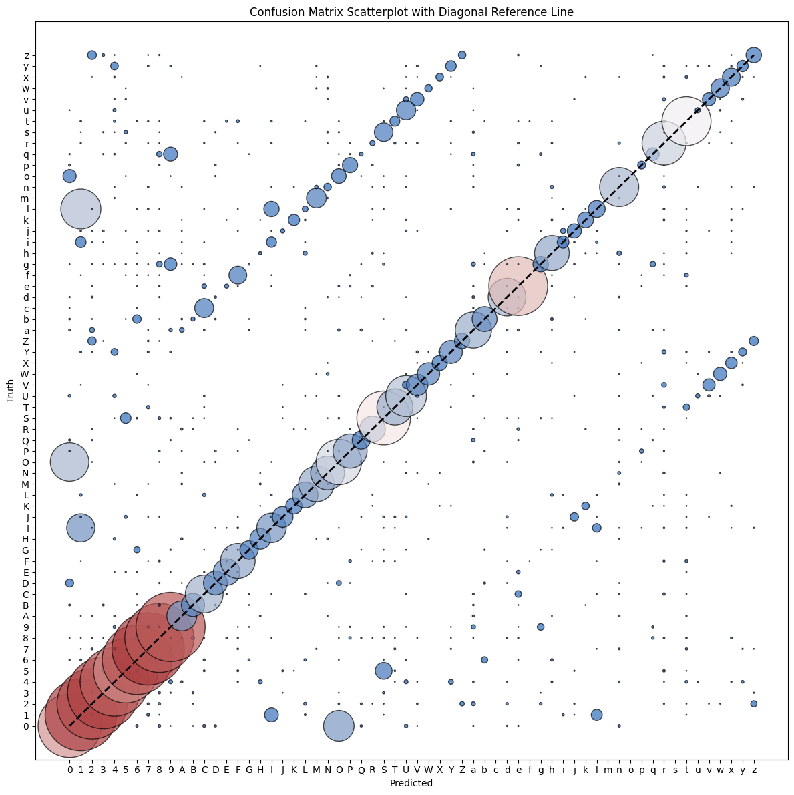

# Live Number and Character Recognition

Real-time digit and character recognition using CNN models with webcam or Android phone camera input.

## Overview

This project uses Convolutional Neural Networks (CNNs) to recognize handwritten digits (0-9) and characters (A-Z, a-z) in real-time. The system includes two trained models:
- **Digits model** (`models/digits_model.h5`): Recognizes numbers 0-9
- **Characters + Digits model** (`models/chars_and_digits_model.h5`): Recognizes both letters and numbers using EMNIST dataset

Two interfaces are available:
- **Desktop webcam** (`ocr-desktop/webcam_recognition.py`): OpenCV-based real-time recognition from your webcam
- **Android app** (`ocr-android/`): CameraX-based app that streams frames to a Flask server for inference, with pinch-to-zoom and an interactive draggable/resizable ROI bounding box

## Features

- Real-time recognition with live preview (desktop or Android)
- Switchable modes between digit-only and character+digit recognition
- Preprocessing pipeline for improved accuracy (bilateral filtering, Otsu's binarization, resizing)
- Visual feedback with confidence scores and threshold image preview
- ROI (Region of Interest) selection for focused recognition
- **Android app interactive controls:**
  - Pinch-to-zoom using CameraX native digital zoom
  - Drag the green bounding box to reposition the ROI
  - Drag any of the 4 corner handles to resize the ROI
  - Server adapts to the user-defined ROI in real-time

## Live Demos

| Demo 1 | Demo 2 |
| --- | --- |
|  |  |

### Android app demo
<video controls src="Docs/App-Demo.mp4" width="100%"></video>

## Model Insights

- **CharCNN confusion matrix:** 
- **CNN activations before hidden layer:** 
- **CNN activations after hidden layer:** 

## Setup

### Desktop (webcam)

1. Install dependencies:
```bash
pip install -r ocr-desktop/requirements.txt
```

2. Run the webcam recognition (from the `ocr-desktop` folder):
```bash
cd ocr-desktop
python webcam_recognition.py
```

### Android app

1. Start the Flask server on your desktop:
```bash
cd ocr-desktop
python server.py
```
2. Note your desktop's LAN IP (e.g., `123.000.0.000`). The server prints it on startup.
3. Copy the server config template:
```bash
cp ocr-android/app/src/main/java/com/example/ocrrecognition/ServerConfig.kt.example \
   ocr-android/app/src/main/java/com/example/ocrrecognition/ServerConfig.kt
```
4. Edit `ServerConfig.kt` and replace `YOUR_DESKTOP_IP` with your desktop's LAN IP:
```kotlin
const val SERVER_URL = "http://123.000.0.000:5000/predict"
```
5. Build and run the app on your Android device using Android Studio.

> **Note:** `ServerConfig.kt` is gitignored to prevent committing personal IP addresses. Only `ServerConfig.kt.example` is tracked in the repository.

## Usage

### Desktop webcam
- **Q**: Quit the application
- **M**: Switch between digit mode and character mode
- Draw digits or characters in the ROI box (green rectangle)
- Recognition results display with confidence scores

### Android app
- **Pinch anywhere** on the camera preview to zoom in/out
- **Drag the green box** to reposition the ROI
- **Drag any corner handle** to resize the ROI
- Tap **Switch to CHAR / DIGIT** to toggle recognition modes
- Prediction label and threshold image display on screen

## Training

### Digits-only model (`training/digits_only/CNN.ipynb`)
1. **Download + preprocess MNIST:** Run the early cells to pull the dataset, visualize sample digits, normalize pixel values to `[0,1]`, and flatten images into 784-length vectors (`X_train_flattened`).
2. **Train baseline classifier:** Execute the dense-only model (single dense layer with sigmoid) for 5 epochs to learn a quick linear classifier and inspect the confusion matrix.
3. **Add hidden layer for higher accuracy:** Run the second model definition (ReLU hidden layer + sigmoid output) for ~10 epochs; this MLP captures nonlinear patterns and typically reaches ~97% accuracy.
4. **Evaluate + export:** Use `model.evaluate(X_test_flattened, y_test)` to verify accuracy, then persist weights via `model.save('models/digits_model.h5')` for inference scripts like `webcam_recognition.py`.

### Characters + digits model (`training/CharCNN_explore.ipynb` / `training/digits_and_chars/CharCNN_train.py`)
1. **Pull the full EMNIST dataset:** Install `emnist` (see notebook comment) and run the download cell; this caches ~500 MB of `byclass` samples so the notebook can reuse them offline.
2. **Normalize + reshape for CNN input:** Convert grayscale images to `(batch, 28, 28, 1)` tensors and confirm the pixel range (min/max cell) so convolutional layers get standardized data.
3. **Build the CNN 2.0 stack:** The notebook constructs three Conv-BatchNorm blocks with pooling + dropout, followed by global average pooling and a dense layer outputting 62 logits—covering digits plus upper/lower-case letters.
4. **Train with smart callbacks:** Run `history = model.fit(...)` using `ReduceLROnPlateau` and `EarlyStopping` to automatically lower the learning rate and halt when validation loss plateaus (usually <20 epochs with 0.2 validation split).
5. **Evaluate, visualize, and save:** Evaluate against the EMNIST test set, run the confusion-matrix plotting cells for diagnostics, then export the final weights via `model.save('models/chars_and_digits_model.h5')`.

To run the finalized training pipeline end-to-end:
```bash
python training/digits_and_chars/CharCNN_train.py
```

> Tip: Use `training/CharCNN_explore.ipynb` for interactive cell-by-cell experimentation, or `training/digits_and_chars/CharCNN_train.py` to run the full pipeline end-to-end.

## Requirements

- Python 3.x
- OpenCV
- TensorFlow/Keras
- NumPy
- Matplotlib

